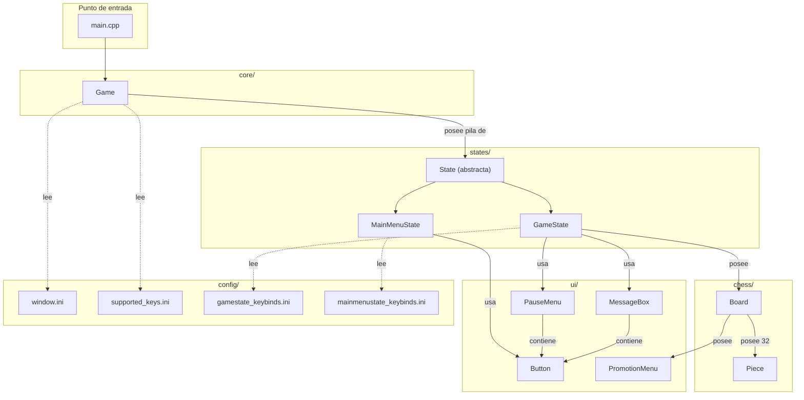
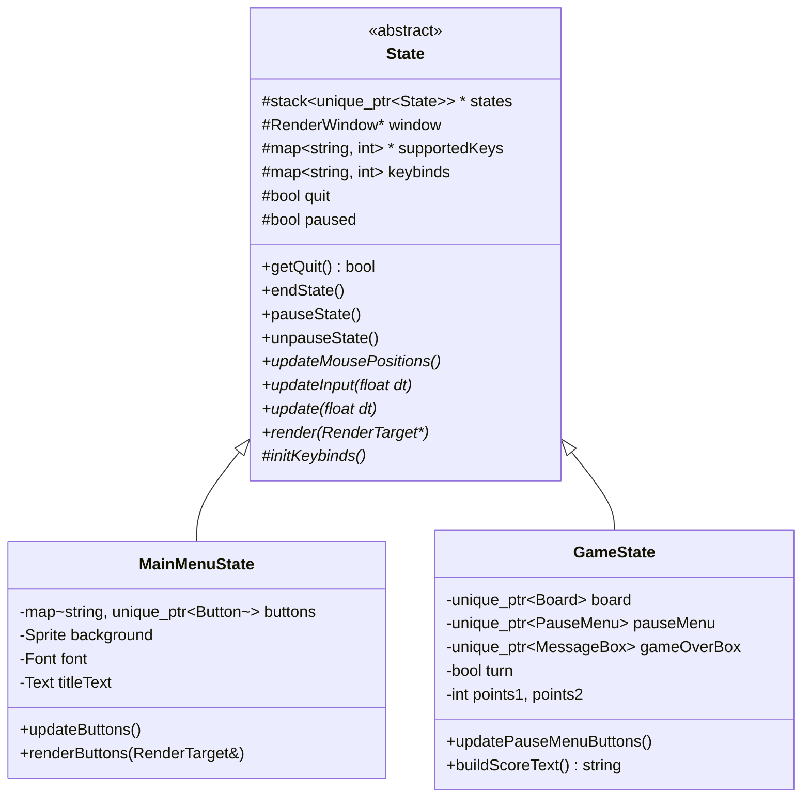
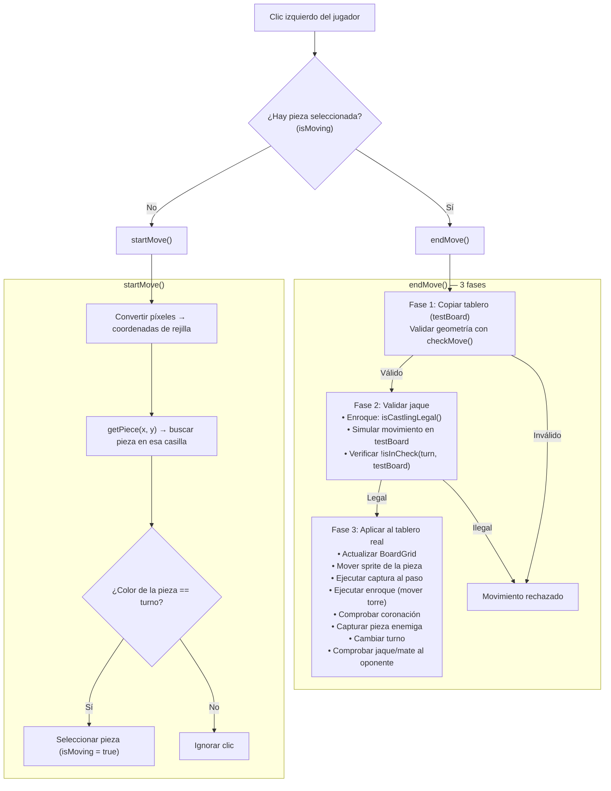

# Arquitectura de SimplyChess

Documentación técnica sobre la arquitectura, los módulos y el funcionamiento interno del
proyecto.

## Visión general

SimplyChess es un juego de ajedrez para dos jugadores locales desarrollado en **C++20** con
**SFML 2.6.1** como biblioteca gráfica. El sistema de compilación es **CMake ≥ 3.14**, que
descarga SFML automáticamente mediante `FetchContent` en la primera compilación.

La arquitectura se basa en una **pila de estados** (`State stack`): el bucle principal
actualiza y renderiza únicamente el estado en la cima de la pila. Cada pantalla del juego
(menú, partida) es un estado independiente que puede apilarse o desapilarse.

## Diagrama de componentes



## Jerarquía de herencia



---

## Módulos

### `core/` — Bucle principal

Contiene únicamente la clase `Game`, que es el punto de entrada de la aplicación.

**Responsabilidades:**

- Crear y configurar la ventana SFML (leyendo `config/window.ini`).
- Cargar las teclas soportadas desde `config/supported_keys.ini`.
- Gestionar la pila de estados (`std::stack<std::unique_ptr<State>>`).
- Ejecutar el bucle principal del juego.

**Bucle principal (`Game::run`):**

```
while (ventana abierta) {
    1. updateDT()        → calcula delta-time (dtClock.restart().asSeconds())
    2. update()          → procesa eventos SFML + actualiza estado de la cima
                           + desapila si el estado ha terminado (quit == true)
                           + cierra ventana si la pila queda vacía
    3. render()          → limpia pantalla + renderiza estado de la cima + display
}
```

> [!NOTE]
> El bucle utiliza **delta-time variable** (no acumulador de tiempo fijo). Esto significa
> que la velocidad de la lógica depende del framerate, aunque al tratarse de un juego por
> turnos el impacto es mínimo.

**Relación con los estados:** `Game` pasa punteros crudos (`window*`,
`supportedKeys*`, `states*`) a cada estado en su constructor. Los estados pueden
apilar nuevos estados gracias al puntero a la pila.

**Archivos:**
- [`Game.h`](file:///Users/luissantra/Projects/Simply%20Chess/include/core/Game.h)
- [`Game.cpp`](file:///Users/luissantra/Projects/Simply%20Chess/src/core/Game.cpp)

---

### `states/` — Pantallas del juego

Implementa el patrón **State stack**. Cada pantalla es una subclase de `State` que
define su propia lógica de entrada, actualización y renderizado.

#### `State` (clase base abstracta)

Define el contrato común para todos los estados:

| Método virtual puro | Propósito |
|---|---|
| `initKeybinds()` | Carga los atajos de teclado del estado |
| `updateInput(dt)` | Procesa la entrada del usuario |
| `update(dt)` | Actualiza la lógica del estado |
| `render(target)` | Dibuja el estado |

Ofrece funcionalidad compartida:
- **Gestión de vida:** `endState()`, `pauseState()`, `unpauseState()`
- **Ratón:** `updateMousePositions()` actualiza coordenadas en pantalla, ventana y vista
- **Antirrebote:** `keytime` / `keytimeMax` evita pulsaciones múltiples involuntarias
- **Almacén de texturas:** `std::map<string, sf::Texture> textures` propiedad de cada estado

#### `MainMenuState`

Pantalla de menú principal con título y tres botones:

| Botón | Acción |
|---|---|
| Start | Apila un nuevo `GameState` |
| Settings | Sin implementar (no-op) |
| Exit | Marca `quit = true` → se desapila |

#### `GameState`

Pantalla de partida activa. Gestiona:

- El **tablero** (`Board`) como composición.
- El **menú de pausa** (`PauseMenu`) con botones Exit y Continue.
- El **cuadro de fin de partida** (`MessageBox`) mostrado al detectar jaque mate.
- El **marcador** (`sf::Text`) con los nombres y puntos de los jugadores.
- El **turno** (`bool turn`: `true` = blancas).

**Flujo de entrada (`updateInput`):**
1. **Esc** → alterna pausa/reanudación.
2. **Clic izquierdo** (sin pausa, sin fin de juego) → delega a `board->movePiece()`.
3. **Fin de juego** (`board->getEndGame()`) → muestra `gameOverBox`; acepta el botón
   Exit solo tras soltar el ratón al menos una vez (previene falsos positivos).

**Archivos:**
- [`State.h`](file:///Users/luissantra/Projects/Simply%20Chess/include/states/State.h) / [`State.cpp`](file:///Users/luissantra/Projects/Simply%20Chess/src/states/State.cpp)
- [`MainMenuState.h`](file:///Users/luissantra/Projects/Simply%20Chess/include/states/MainMenuState.h) / [`MainMenuState.cpp`](file:///Users/luissantra/Projects/Simply%20Chess/src/states/MainMenuState.cpp)
- [`GameState.h`](file:///Users/luissantra/Projects/Simply%20Chess/include/states/GameState.h) / [`GameState.cpp`](file:///Users/luissantra/Projects/Simply%20Chess/src/states/GameState.cpp)

---

### `ui/` — Componentes de interfaz

Todos los componentes de UI siguen el mismo patrón:
- Reciben referencias a fuentes y texturas en el constructor.
- Exponen `update(mousePos)` y `render(target)`.
- No tienen herencia entre sí; son clases independientes.

#### `Button`

Botón basado en una **sprite sheet de 3 fotogramas horizontales** (reposo, hover, pulsado).
Cada fotograma se selecciona con `setTextureRect()` según el estado (`ButtonStates`).

```
┌──────────┬──────────┬──────────┐
│   Idle   │  Hover   │  Active  │
│ (reposo) │ (ratón   │ (clic)   │
│          │  encima) │          │
└──────────┴──────────┴──────────┘
     ← width →  ← width →  ← width →
```

Soporta texto centrado con colores independientes por estado y escalado dinámico.

#### `MessageBox`

Cuadro de diálogo con texto y un botón. Usado para el aviso de fin de partida. Consiste
en un `sf::RectangleShape` semitransparente (300×300 px) con texto centrado y un `Button`.

#### `PauseMenu`

Superposición de pausa con un contenedor semitransparente y botones dinámicos. Los
botones se añaden con `addButton(key, x, y, text, texture)` y se consultan con
`isButtonPressed(key)`.

#### `PromotionMenu`

Menú de coronación que muestra 4 piezas elegibles (dama, caballo, alfil, torre) usando
una sprite sheet. La mitad izquierda (50 px) contiene las piezas blancas y la derecha
las negras, con 4 filas de 50 px cada una.

```
┌─────┬─────┐
│ ♕ B │ ♛ N │  ← Dama    (y ≤ 50)
├─────┼─────┤
│ ♘ B │ ♞ N │  ← Caballo (y ≤ 100)
├─────┼─────┤
│ ♗ B │ ♝ N │  ← Alfil   (y ≤ 150)
├─────┼─────┤
│ ♖ B │ ♜ N │  ← Torre   (y > 150)
└─────┴─────┘
  50px  50px
```

**Archivos:**
- [`Button.h`](file:///Users/luissantra/Projects/Simply%20Chess/include/ui/Button.h) / [`Button.cpp`](file:///Users/luissantra/Projects/Simply%20Chess/src/ui/Button.cpp)
- [`MessageBox.h`](file:///Users/luissantra/Projects/Simply%20Chess/include/ui/MessageBox.h) / [`MessageBox.cpp`](file:///Users/luissantra/Projects/Simply%20Chess/src/ui/MessageBox.cpp)
- [`PauseMenu.h`](file:///Users/luissantra/Projects/Simply%20Chess/include/ui/PauseMenu.h) / [`PauseMenu.cpp`](file:///Users/luissantra/Projects/Simply%20Chess/src/ui/PauseMenu.cpp)
- [`PromotionMenu.h`](file:///Users/luissantra/Projects/Simply%20Chess/include/ui/PromotionMenu.h) / [`PromotionMenu.cpp`](file:///Users/luissantra/Projects/Simply%20Chess/src/ui/PromotionMenu.cpp)

---

### `chess/` — Lógica del ajedrez

El corazón del juego. Contiene dos clases: `Board` (el tablero y las reglas) y `Piece`
(cada pieza individual con su validación de movimiento).

#### Modelo de datos — Representación dual del tablero

El tablero se mantiene en **dos representaciones paralelas** que deben estar sincronizadas
manualmente:

**1. `BoardGrid` — Grid de strings 8×8**

```cpp
using BoardGrid = std::array<std::array<std::string, 8>, 8>;
```

Cada celda contiene un código de 2 caracteres:

| Código | Significado |
|---|---|
| `"+"` | Casilla blanca vacía |
| `"-"` | Casilla negra vacía |
| `"PB"` | Peón blanco |
| `"TN"` | Torre negra |
| `"CB"` | Caballo blanco |
| `"AN"` | Alfil negro |
| `"QB"` | Dama (queen) blanca |
| `"KN"` | Rey (king) negro |

El primer carácter indica el tipo de pieza (`P`eón, `T`orre, `C`aballo, `A`lfil,
`Q`ueen/Dama, `K`ing/Rey) y el segundo el color (`B`lanca, `N`egra).

**2. `pieces[16][2]` — Array de objetos Piece**

```cpp
std::array<std::array<std::unique_ptr<Piece>, 2>, 16> pieces;
```

Los 32 objetos `Piece` se organizan así (el segundo índice es el color: 0=negro, 1=blanco):

| Índice | Pieza |
|---|---|
| 0, 1 | Torres |
| 2, 3 | Caballos |
| 4, 5 | Alfiles |
| 6 | Dama |
| 7 | Rey |
| 8–15 | Peones |

Las piezas capturadas se marcan como `active = false` y se mueven fuera de pantalla a la
posición (-100, -100), pero permanecen en el array.

#### Estados especiales del juego

```cpp
// Flags de enroque: [0] corto blancas, [1] largo blancas,
//                   [2] corto negras, [3] largo negras, [4] rey movido
using CastlingState = std::array<bool, 5>;

// Captura al paso: por columna (0-7), [col][0] = peón negro elegible,
//                                      [col][1] = peón blanco elegible
using EnPassantState = std::array<std::array<bool, 2>, 8>;

// Jaque: [0] = negras en jaque, [1] = blancas en jaque
std::array<bool, 2> jaque;
```

#### Clase `Piece`

Cada pieza conoce su tipo, color, posición (en píxeles y en la rejilla), puntuación y
sabe validar sus propios movimientos.

**Valores de las piezas:**

| Tipo | `PieceType` | Puntos |
|---|---|---|
| Peón | `PEON (0)` | 1 |
| Torre | `TORRE (1)` | 5 |
| Caballo | `CABALLO (2)` | 3 |
| Alfil | `ALFIL (3)` | 3 |
| Dama | `REINA (4)` | 9 |
| Rey | `REY (5)` | 0 |

**Validación de movimiento:** `Piece::checkMove()` despacha a un método privado
específico según el tipo:

| Método | Lógica |
|---|---|
| `checkMoveKing()` | 1 casilla en cualquier dirección + enroque completo |
| `checkMoveQueen()` | Combina lógica de torre + alfil |
| `checkMoveTorre()` | Deslizamiento horizontal/vertical con comprobación de camino libre |
| `checkMoveAlfil()` | Deslizamiento diagonal con comprobación de camino libre |
| `checkMoveCaballo()` | Movimiento en L (sin comprobación de camino) |
| `checkMovePeon()` | Avance 1/2 casillas, captura diagonal, captura al paso |

#### Flujo de movimiento

El movimiento se procesa en dos fases a través de `Board::movePiece()`:



> [!IMPORTANT]
> **¿Por qué se usa una copia del tablero?** El método `checkMoveKing()` tiene **efectos
> secundarios**: modifica el grid del tablero para mover la torre durante la validación
> del enroque. Operar sobre una copia (`testBoard`) evita corromper el estado real si el
> movimiento resulta ilegal.

#### Reglas especiales implementadas

**Enroque (corto y largo, ambos colores):**
- Verificación de camino despejado entre rey y torre.
- `isCastlingLegal()`: el rey no debe estar en jaque ni pasar por casilla amenazada.
- Al ejecutar: el rey se mueve 2 casillas y la torre salta al otro lado.

**Captura al paso (en passant):**
- Se activa cuando un peón avanza 2 casillas en su primer movimiento.
- `EnPassantState` registra la elegibilidad por columna y color.
- Los flags se resetean cada turno.
- `peonPasoMovement()` elimina el peón capturado.

**Coronación de peones:**
- Se detecta cuando un peón alcanza la fila 0 (negras) o 7 (blancas).
- Se muestra el `PromotionMenu` con las 4 opciones.
- La pieza se muta in-place: se cambia su tipo, textura y puntuación.

**Jaque y jaque mate:**
- `isInCheck(color, board)`: localiza el rey en el grid y verifica si alguna pieza
  enemiga puede alcanzarlo mediante `isMenaced()`.
- `isCheckmate(color)`: para cada pieza activa del bando en jaque, intenta todos los
  destinos posibles simulando el movimiento en una copia. Devuelve `true` solo si
  **ningún** movimiento legal resuelve el jaque. *Nota: En realidad, esta función comprueba si hay cualquier movimiento legal disponible, por lo que su lógica se reutiliza directamente para la detección de ahogado (stalemate).*

**Archivos:**
- [`Board.h`](file:///Users/luissantra/Projects/Simply%20Chess/include/chess/Board.h) / [`Board.cpp`](file:///Users/luissantra/Projects/Simply%20Chess/src/chess/Board.cpp)
- [`Piece.h`](file:///Users/luissantra/Projects/Simply%20Chess/include/chess/Piece.h) / [`Piece.cpp`](file:///Users/luissantra/Projects/Simply%20Chess/src/chess/Piece.cpp)

---

## Configuración

Los archivos `.ini` en `config/` se leen línea a línea durante la inicialización.

### `window.ini`

```
Simply Chess Alpha 0.5     ← título de la ventana (línea completa)
1120 820                    ← ancho y alto en píxeles
0                           ← pantalla completa (0/1)
60                          ← límite de FPS
1                           ← V-Sync activado (0/1)
4                           ← nivel de antialiasing
```

### `supported_keys.ini`

```
Escape 36                   ← nombre_tecla código_SFML
```

Mapea nombres legibles a valores enteros de `sf::Keyboard::Key`.

### `gamestate_keybinds.ini` / `mainmenustate_keybinds.ini`

```
CLOSE Escape                ← nombre_acción nombre_tecla
```

Mapea acciones del estado a teclas definidas en `supported_keys.ini`.
En `GameState`, la acción `CLOSE` alterna pausa/reanudación.

---

## Recursos

```
resources/
├── fonts/
│   ├── ELECTROL.TTF
│   ├── Factory LJDS.ttf    ← fuente usada en la UI
│   └── Gameplay.ttf
└── images/
    ├── Tablero.png          ← textura del tablero 800×800
    ├── interface/
    │   ├── background.png   ← fondo del panel lateral
    │   ├── buttons.png      ← sprite sheet de botones (3 fotogramas)
    │   └── promotionMenu.png
    ├── menu/
    │   ├── background.png   ← fondo del menú principal
    │   └── logo.png
    └── pieces/              ← 12 PNGs (6 tipos × 2 colores)
        ├── PeonB.png, PeonN.png
        ├── TorreB.png, TorreN.png
        ├── CaballoB.png, CaballoN.png
        ├── AlfilB.png, AlfilN.png
        ├── ReinaB.png, ReinaN.png
        └── ReyB.png, ReyN.png
```

---

## Constantes globales

| Constante | Valor | Definida en | Uso |
|---|---|---|---|
| `CELL_SIZE` | 100 px | `Piece.h` | Tamaño de cada casilla del tablero |
| `BOARD_SIZE` | 800 px | `Board.h` | Lado total del tablero (8 × 100) |

---

## Deuda técnica conocida

| Problema | Impacto | Ubicación |
|---|---|---|
| **Representación dual** del tablero (grid de strings + objetos Piece) que debe sincronizarse manualmente | Propenso a inconsistencias; cualquier modificación requiere actualizar ambas estructuras | `Board` |
| **`getPiece(x, y)` con búsqueda lineal** O(32) en cada llamada | Ineficiente; se llama múltiples veces por movimiento | [`Board.cpp`](file:///Users/luissantra/Projects/Simply%20Chess/src/chess/Board.cpp) |
| **`checkMoveKing()` con efectos secundarios** que modifican el grid al validar enroque | Obliga a operar sobre copias; la función de validación no es pura | [`Piece.cpp`](file:///Users/luissantra/Projects/Simply%20Chess/src/chess/Piece.cpp) |
| **Sin detección de ahogado** (stalemate) | El juego se bloquea si un jugador no tiene movimientos legales sin estar en jaque | `Board` |
| **Botón Settings** sin implementar | Visible pero sin funcionalidad | `MainMenuState` |
| **Flag `castling[4]`** (rey movido) compartido entre ambos colores | Posible bug: mover un rey podría afectar al estado de enroque del otro | `Board` / `Piece` |
| **Piezas capturadas** permanecen en el array `pieces[16][2]` y se renderizan fuera de pantalla (-100, -100) | Desperdicio de ciclos de renderizado. Deberían borrarse del todo | `Board` |
| **Gestión del ratón en coronación** difiere del flujo normal | Código reconocido como inconsistente (comentario: "Esto esta MUY RARO...") | [`Board.cpp`](file:///Users/luissantra/Projects/Simply%20Chess/src/chess/Board.cpp) |
| **Coordenadas invertidas (`gridPos` vs `pos`)** | `pos.x` se calcula usando `gridPos.y` y viceversa; las coordenadas lógicas y visuales están transpuestas | `Piece.cpp` |
| **Falta separar inicialización y limpieza** | Todo ocurre en el constructor/destructor; sería ideal refactorizar usando `startGame()` y `endGame()` | `GameState` |
